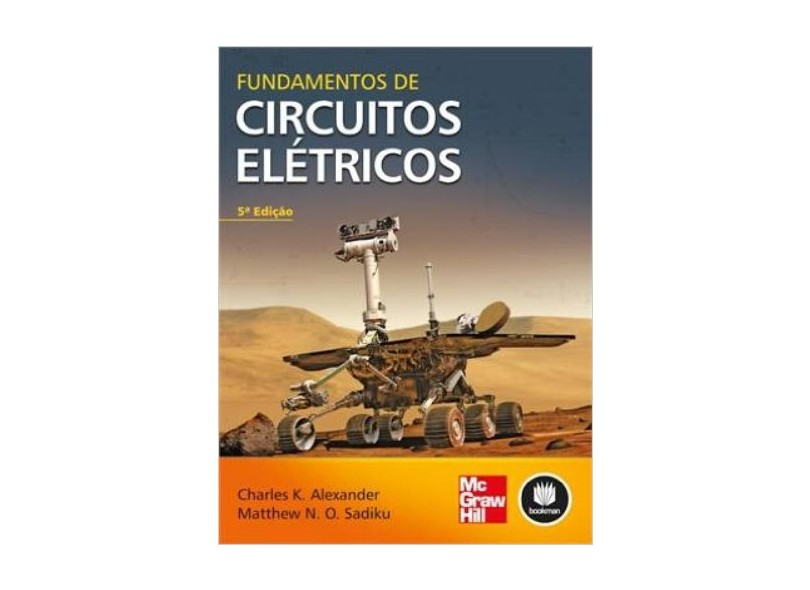
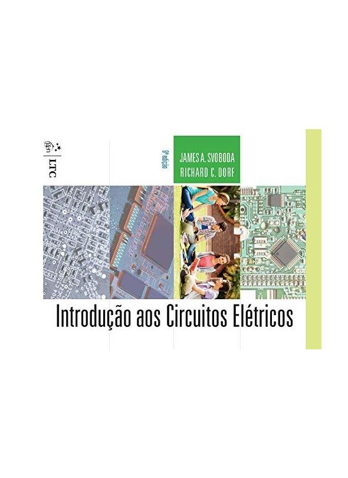

```{r setup, include=FALSE}
# Habilita circuitikz nos chunks {tikz} desta aula (roadmap de unidades).
knitr::opts_chunk$set(engine.opts = list(
  extra.preamble = c("\\usepackage{circuitikz}"),
  classoption = "tikz,multi=circuitikz"
))
```

## Identificação

::: {.columns}
::: {.column width="50%"}

- **Universidade:** Universidade Federal do Pará
- **Campus:** Campus Universitário de Tucuruí
- **Faculdade:** Faculdade de Engenharia Elétrica
- **Curso:** Engenharia Elétrica
- **Professor:** Dr. Raphael Barros Teixeira
- **E-mail:** raphaelbt@ufpa.br

:::
::: {.column width="50%"}

- **Disciplina:** Circuitos Elétricos II
- **Caráter:** Obrigatória
- **Carga horária:** 60h (30 aulas de 2h, terças e quintas)
- **Regime de oferta:** Extensivo
- **Período de oferta:** 31/08/2026 a 19/12/2026
- **Período letivo:** 2026.4
- **Pré-requisitos:** Circuitos Elétricos I, Análise de Sistemas Lineares, Funções de uma Variável Complexa

:::
:::

---

## Panorama da Disciplina

Circuitos Elétricos II estende, para o regime **senoidal permanente (CA)**, todo o ferramental de análise de circuitos resistivos visto em Circuitos Elétricos I — fasores no lugar de números reais, impedância no lugar de resistência.

```{tikz}
%| echo: false
%| fig-align: center
%| fig-width: 15
\usetikzlibrary{arrows.meta, positioning}
\input{imgs/tikz/RoadmapUnidades.tikz}
```

::: {.callout-tip}
Cada unidade retoma, em CA, um conceito já visto em Circuitos Elétricos I para circuitos resistivos em regime contínuo (CC).
:::

---

## Ementa

Análise de circuitos elétricos em regime permanente senoidal (corrente alternada).
Representação de sinais senoidais no domínio do tempo e no domínio fasorial.
Relações tensão-corrente nos elementos passivos R, L e C em regime senoidal.
Impedância e admitância complexas. Associações série, paralela e mistas em CA.
Leis de Kirchhoff aplicadas a circuitos em CA. Métodos sistemáticos de análise:
análise nodal e análise de malhas em regime senoidal. Teoremas de circuitos
(superposição, Thévenin, Norton e máxima transferência de potência) aplicados a
circuitos em CA. Potência em CA: potência instantânea, ativa, reativa, aparente,
complexa e fator de potência. Correção do fator de potência. Circuitos
trifásicos equilibrados nas configurações estrela e triângulo; cálculo de
potência em sistemas trifásicos.

---

## Objetivo Geral

Capacitar o(a) estudante a analisar circuitos elétricos lineares em regime
permanente senoidal, utilizando a representação fasorial e os métodos
sistemáticos de análise de circuitos, com aplicação ao cálculo de potência em
sistemas monofásicos e trifásicos.

Ao final da disciplina, espera-se que o(a) discente seja capaz de analisar
circuitos elétricos em regime senoidal permanente utilizando fasores,
impedâncias, teoremas de circuitos e os métodos de malhas e de nós, além de
determinar a potência envolvida em circuitos monofásicos e trifásicos.

---

## Objetivos Específicos — Senoides a Análise de Circuitos

- Compreender a representação de sinais senoidais por meio de fasores e a transformação entre os domínios do tempo e da frequência.
- Determinar as relações tensão-corrente e a impedância dos elementos R, L e C em regime senoidal.
- Resolver circuitos série, paralelo e mistos em CA utilizando impedância complexa.
- Aplicar as leis de Kirchhoff, a análise nodal e a análise de malhas a circuitos em regime senoidal.

---

## Objetivos Específicos — Teoremas, Potência e Trifásico

- Aplicar os teoremas de circuitos (superposição, Thévenin, Norton e máxima transferência de potência) a circuitos em CA.
- Calcular potência instantânea, ativa, reativa, aparente e complexa, e realizar a correção do fator de potência.
- Analisar circuitos trifásicos equilibrados e calcular a potência em sistemas trifásicos.

---

## Competências e Habilidades

- Representar grandezas senoidais na forma fasorial e operar com impedâncias de elementos resistivos, indutivos e capacitivos.
- Analisar circuitos série e paralelo em regime senoidal permanente.
- Aplicar as leis circuitais e os teoremas de circuitos à análise de circuitos de corrente alternada.
- Utilizar os métodos de análise de malhas e de nós na solução de circuitos CA.
- Calcular a potência em circuitos monofásicos e trifásicos.

::: {.callout-note}
Competências relacionadas à seção 3.4 (Competências e Habilidades), p. 13, do PPC de Engenharia Elétrica de 2012.
:::

---

## Conteúdo Programático — Visão Geral (1/2)

| Unidade | Conteúdo | Aulas | Carga horária |
|:--:|:--|:--:|:--:|
| 1 | Senoides e fasores | 2 | 4h |
| 2 | Impedância, admitância e associações em CA | 4 | 8h |
| 3 | Leis circuitais e métodos de análise em CA | 4 | 8h |
| — | Exercícios, revisão e **Prova A1** (Unidades 1–3) | 4 | 8h |

---

## Conteúdo Programático — Visão Geral (2/2)

| Unidade | Conteúdo | Aulas | Carga horária |
|:--:|:--|:--:|:--:|
| 4 | Teoremas de circuitos em CA | 4 | 8h |
| 5 | Potência em circuitos de corrente alternada | 5 | 10h |
| 6 | Circuitos trifásicos | 4 | 8h |
| — | Exercícios, revisão e **Prova A2** (Unidades 4–6) | 3 | 6h |
| | **Total** | **30** | **60h** |

---

## Conteúdo Programático — Unidade 1

**Senoides e fasores**

- Características de um sinal senoidal: amplitude, frequência angular, período, fase.
- Relação entre seno e cosseno; defasagem entre sinais senoidais.
- Números complexos: forma retangular, polar e exponencial; operações.
- Transformação fasorial: do domínio do tempo para o domínio da frequência e vice-versa.
- Relações fasoriais para os elementos R, L e C.

---

## Conteúdo Programático — Unidade 2

**Impedância, admitância e associações em CA**

- Impedância complexa: definição, resistência e reatância.
- Admitância complexa: condutância e susceptância.
- Diagramas de impedância e triângulo de impedâncias.
- Associação de impedâncias em série e em paralelo.
- Divisores de tensão e de corrente em CA.
- Transformação estrela-triângulo (Y-$\Delta$) de impedâncias.

---

## Conteúdo Programático — Unidade 3

**Leis circuitais e métodos de análise em CA**

- Leis de Kirchhoff das tensões (LKT) e das correntes (LKC) em regime fasorial.
- Análise nodal em circuitos com fontes independentes e dependentes.
- Análise de malhas em circuitos com fontes independentes e dependentes.
- Circuitos com fontes de tensão e de corrente em CA; supernó e supermalha.

---

## Conteúdo Programático — Unidade 4

**Teoremas de circuitos em CA**

- Teorema da superposição aplicado a circuitos com múltiplas fontes senoidais.
- Teorema de Thévenin em regime senoidal.
- Teorema de Norton em regime senoidal.
- Transferência de máxima potência com carga complexa.

---

## Conteúdo Programático — Unidade 5

**Potência em circuitos de corrente alternada**

- Potência instantânea e potência média (ativa).
- Valor eficaz (RMS) de tensão e corrente.
- Potência reativa e potência aparente.
- Potência complexa e triângulo de potências.
- Fator de potência: definição, natureza indutiva e capacitiva.
- Correção do fator de potência por compensação reativa.
- Máxima transferência de potência média.

---

## Conteúdo Programático — Unidade 6

**Circuitos trifásicos**

- Geração de tensões trifásicas; sequência de fases.
- Configurações estrela (Y) e triângulo ($\Delta$) para fonte e carga.
- Circuitos trifásicos equilibrados: Y-Y, Y-$\Delta$, $\Delta$-$\Delta$ e $\Delta$-Y.
- Relações entre grandezas de fase e de linha.
- Potência em sistemas trifásicos equilibrados; método dos dois wattímetros.

---

## Procedimentos e Recursos

::: {.columns}
::: {.column width="55%"}

**Procedimentos metodológicos**

Aulas expositivas e dialogadas, com apoio de recursos visuais e simulações
computacionais (MATLAB/Simulink, Python, LTspice), seguidas da resolução de
listas de exercícios e discussão orientada de estudos de caso aplicados. As
avaliações poderão utilizar questões da prova do ENADE e de concursos
públicos.

:::
::: {.column width="45%"}

**Recursos didáticos**

- Quadro e apoio de recursos audiovisuais (data-show).
- Softwares de simulação de circuitos elétricos.
- SIGAA – UFPA.

:::
:::

---

## Avaliação

A avaliação da aprendizagem será feita por meio de duas provas escritas
bimestrais (A1 e A2), cada uma valendo 10,0 pontos, e de uma lista de
exercícios por bimestre ($Pl_1$, $Pl_2$), valendo no máximo 1,0 ponto cada
(0,5 pela entrega da lista + 0,5 pela resolução, em sala, de uma questão
sorteada da lista). A avaliação poderá ainda ser complementada por trabalhos
individuais ou em grupo, seminários e atividades práticas, a critério do
docente.

$$\mathrm{NF} = \dfrac{A_1 + A_2}{2} + Pl_1 + Pl_2$$

---

## Avaliação — Critérios e Datas

::: {.callout-warning}
## Critério de aprovação
Frequência mínima de 75% da carga horária **e** nota final $\geq 5,0$
(Regulamento de graduação da UFPA). Avaliações escritas limitadas a, no
máximo, duas aplicações por bimestre, nas semanas de prova do calendário
acadêmico.
:::

As avaliações serão realizadas no período de **05 a 09 de outubro de 2026**
(1ª Avaliação) e de **09 a 16 de dezembro de 2026** (2ª Avaliação), conforme
deliberação do Colegiado da Faculdade de Engenharia Elétrica.

Critérios, instrumentos e cronograma avaliativo poderão ser ajustados por
motivos pedagógicos, mediante comunicação prévia aos discentes.

---

## Cronograma — 1º Bimestre (1/5)

| Aulas | Datas | Conteúdo |
|:--:|:--|:--|
| 01 | 01/09 | Apresentação da disciplina; sinal senoidal (amplitude, $\omega$, período, fase); seno $\times$ cosseno; complexos (retangular, polar) |
| 02 | 03/09 | Complexos (forma exponencial); transformação fasorial; relações fasoriais para R, L e C |
| 03 | 08/09 | Impedância complexa: definição, resistência e reatância |

---

## Cronograma — 1º Bimestre (2/5)

| Aulas | Datas | Conteúdo |
|:--:|:--|:--|
| 04 | 10/09 | Admitância complexa; diagramas de impedância e triângulo de impedâncias |
| 05 | 15/09 | Associação de impedâncias em série e em paralelo |
| 06 | 17/09 | Divisores de tensão e corrente em CA; transformação Y-$\Delta$ |

---

## Cronograma — 1º Bimestre (3/5)

| Aulas | Datas | Conteúdo |
|:--:|:--|:--|
| 07 | 22/09 | Leis de Kirchhoff (LKT e LKC) em regime fasorial |
| 08 | 24/09 | Análise nodal (fontes independentes e dependentes) |
| 09 | 29/09 | Análise de malhas (fontes independentes e dependentes) |

---

## Cronograma — 1º Bimestre (4/5)

| Aulas | Datas | Conteúdo |
|:--:|:--|:--|
| 10 | 01/10 | Fontes de tensão e corrente em CA; supernó e supermalha |
| 11 | 06/10 | Aula de exercícios e revisão para a Prova 1 — Unidades 1–3 |
| 12 | 08/10 | **Prova Bimestral (A1)** — Unidades 1–3 |

---

## Cronograma — 1º Bimestre (5/5)

| Aulas | Datas | Conteúdo |
|:--:|:--|:--|
| 13 | 13/10 | Aula de dúvidas e atendimento aos discentes |
| 14 | 15/10 | Aula de exercícios complementares (reforço — Unidades 1–3) |

---

## Cronograma — 2º Bimestre (1/5)

| Aulas | Datas | Conteúdo |
|:--:|:--|:--|
| 15 | 20/10 | Teorema da superposição em circuitos com múltiplas fontes senoidais |
| 16 | 22/10 | Teorema de Thévenin em regime senoidal |
| 17 | 27/10 | Teorema de Norton em regime senoidal |

---

## Cronograma — 2º Bimestre (2/5)

| Aulas | Datas | Conteúdo |
|:--:|:--|:--|
| 18 | 29/10 | Transferência de máxima potência com carga complexa |
| 19 | 03/11 | Potência instantânea e potência média (ativa) |
| 20 | 05/11 | Valor eficaz (RMS) de tensão e corrente |

---

## Cronograma — 2º Bimestre (3/5)

| Aulas | Datas | Conteúdo |
|:--:|:--|:--|
| 21 | 10/11 | Potência reativa e aparente; potência complexa e triângulo de potências |
| 22 | 12/11 | Fator de potência: definição, natureza indutiva e capacitiva |
| 23 | 17/11 | Correção do fator de potência; máxima transferência de potência média |

---

## Cronograma — 2º Bimestre (4/5)

| Aulas | Datas | Conteúdo |
|:--:|:--|:--|
| 24 | 19/11 | Geração de tensões trifásicas; sequência de fases |
| 25 | 24/11 | Configurações Y e $\Delta$; circuitos trifásicos equilibrados (Y-Y, Y-$\Delta$, $\Delta$-$\Delta$, $\Delta$-Y) |
| 26 | 26/11 | Relações entre grandezas de fase e de linha; introdução a desequilibrados |

---

## Cronograma — 2º Bimestre (5/5)

| Aulas | Datas | Conteúdo |
|:--:|:--|:--|
| 27 | 01/12 | Potência em sistemas trifásicos equilibrados; método dos dois wattímetros |
| 28 | 03/12 | Aula de exercícios — lista Unidades 4–6 |
| 29 | 08/12 | Revisão para a Prova Final — Unidades 4–6 |
| 30 | 10/12 | **Prova Final (A2)** — Unidades 4–6 |

---

## Bibliografia

::: {.columns}
::: {.column width="22%"}
{fig-align="center" height="300px"}
:::
::: {.column width="28%"}
**Bibliografia básica**

**Sadiku & Alexander** — *Fundamentos de Circuitos Elétricos*. 5ª ed. AMGH/Bookman [@alexander2013fundamentos].
:::
::: {.column width="22%"}
{fig-align="center" height="300px"}
:::
::: {.column width="28%"}
**Bibliografia complementar**

**Dorf & Svoboda** — *Introdução a Circuitos Elétricos*. 9ª ed. LTC [@dorf2016introducao].
:::
:::

---

## Referências

::: {#refs}
:::

---

## Dúvidas?

- **E-mail:** raphaelbt@ufpa.br
- **SIGAA:** avisos, materiais e listas de exercícios
- Bom semestre a todos(as)!
