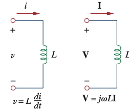
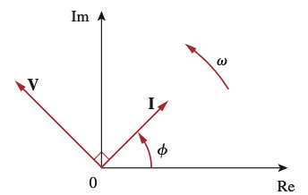
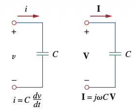
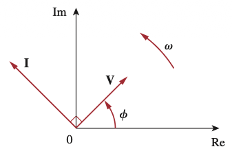
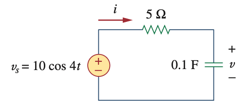
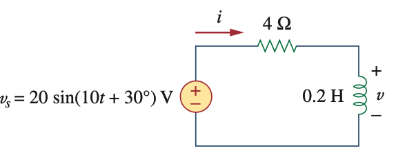

```{r setup, include=FALSE}
# Habilita pgfplots nos chunks {tikz} desta aula (gráficos de senoides).
knitr::opts_chunk$set(engine.opts = list(
  extra.preamble = c("\\usepackage{pgfplots}", "\\pgfplotsset{compat=1.18}")
))
```


---

## Resistor

Resistor $R$, corrente $i(t)$, tensão $v(t)$, Lei de Ohm:

$$i(t) = I_m\cos(\omega t + \phi_i) \rightarrow v(t) = R i(t) = R I_m\cos(\omega t + \phi_i)$$

Forma fasorial: $\;\mathbf{V} = R \mathbf{I} \qquad \rightarrow \qquad \mathbf{V} = V_m\angle\phi_v \text{ e } \mathbf{I} = I_m\angle\phi_i$

::: {.columns}
::: {.column width="50%"}
{fig-align="center" width="520px"}
:::
::: {.column width="50%"}
{fig-align="center" width="520px"}
:::
:::

---

## Indutor

Indutor $L$, corrente $i(t)$, tensão $v(t)$:

$$i(t) = I_m\cos(\omega t + \phi_i) \rightarrow v(t) = L\frac{di(t)}{dt} = \omega L I_m\cos(\omega t + \phi_i + 90°)$$

Forma fasorial: $\;\mathbf{V} = j\omega L\, \mathbf{I} \qquad \rightarrow \qquad \mathbf{V} = V_m\angle\phi_v \text{ e } \mathbf{I} = I_m\angle\phi_i\text{, com }\phi_v = \phi_i + 90°$

::: {.columns}
::: {.column width="50%"}
{fig-align="center" width="460px"}
:::
::: {.column width="50%"}
{fig-align="center" width="650px"}
:::
:::

---

## Capacitor

Capacitor $C$, tensão $v(t)$, corrente $i(t)$:

$$v(t) = V_m\cos(\omega t + \phi_v) \rightarrow i(t) = C\frac{dv(t)}{dt} = \omega C V_m\cos(\omega t + \phi_v + 90°)$$

Forma fasorial: $\;\mathbf{I} = j\omega C\, \mathbf{V} \qquad \rightarrow \qquad \mathbf{V} = V_m\angle\phi_v \text{ e } \mathbf{I} = I_m\angle\phi_i\text{, com }\phi_i = \phi_v + 90°$

::: {.columns}
::: {.column width="50%"}
{fig-align="center" width="460px"}
:::
::: {.column width="50%"}
{fig-align="center" width="650px"}
:::
:::

---

## Resumo: Relações Tensão-Corrente

| Elemento | Domínio do Tempo | Domínio Fasorial |
|:--:|:--:|:--:|
| $R$ | $v = Ri$ | $\mathbf{V} = R\mathbf{I}$ |
| $L$ | $v = L\dfrac{di}{dt}$ | $\mathbf{V} = j\omega L\mathbf{I}$ |
| $C$ | $i = C\dfrac{dv}{dt}$ | $\mathbf{V} = \dfrac{\mathbf{I}}{j\omega C}$ |

---

## Impedância

As três relações tensão-corrente no domínio fasorial,

$$\mathbf{V} = R\mathbf{I}, \qquad \mathbf{V} = j\omega L\mathbf{I}, \qquad \mathbf{V} = \frac{\mathbf{I}}{j\omega C}$$

podem ser escritas em termos da razão entre o fasor de tensão e o fasor de corrente:

$$\frac{\mathbf{V}}{\mathbf{I}} = R, \qquad \frac{\mathbf{V}}{\mathbf{I}} = j\omega L, \qquad \frac{\mathbf{V}}{\mathbf{I}} = \frac{1}{j\omega C}$$

Dessas três expressões, obtemos a **Lei de Ohm na forma fasorial** para qualquer elemento:

$$\boxed{\mathbf{Z} = \frac{\mathbf{V}}{\mathbf{I}} \qquad \text{ou} \qquad \mathbf{V} = \mathbf{Z}\mathbf{I}}$$

---

## Impedância — Conceito

::: {.callout-tip}
## Definição
A **impedância** $\mathbf{Z}$ de um circuito é a razão entre o fasor de tensão $\mathbf{V}$ e o fasor de corrente $\mathbf{I}$, medida em ohms ($\Omega$). Embora seja a razão entre dois fasores, **não é ela própria um fasor** — não corresponde a uma grandeza senoidal.
:::

**Casos extremos:** em $\omega=0$ (CC), $\mathbf{Z}_L=0$ (curto-circuito) e $\mathbf{Z}_C\to\infty$ (circuito aberto); em $\omega\to\infty$, $\mathbf{Z}_L\to\infty$ (aberto) e $\mathbf{Z}_C=0$ (curto).

**Forma retangular:** $\mathbf{Z} = R + jX$, com $R=\text{Re}\,\mathbf{Z}$ (resistência) e $X=\text{Im}\,\mathbf{Z}$ (reatância) — indutiva/atrasada se $X>0$, capacitiva/adiantada se $X<0$.

**Forma polar:** $\mathbf{Z} = |\mathbf{Z}|\angle\theta$

---

## Impedância — Retangular e Polar

Comparando as formas retangular e polar, obtemos:

$$\boxed{\mathbf{Z} = R + jX = |\mathbf{Z}|\angle\theta}$$

onde

$$|\mathbf{Z}| = \sqrt{R^2+X^2}, \qquad \theta = \tan^{-1}\frac{X}{R}$$

e

$$R = |\mathbf{Z}|\cos\theta, \qquad X = |\mathbf{Z}|\sin\theta$$

---

## Admitância

::: {.callout-tip}
## Definição
A **admitância** $\mathbf{Y}$ é o recíproco da impedância, medida em siemens (S).
:::

A admitância $\mathbf{Y}$ de um elemento (ou circuito) é a razão entre o fasor de corrente através dele e o fasor de tensão sobre ele:

$$\boxed{\mathbf{Y} = \frac{1}{\mathbf{Z}} = \frac{\mathbf{I}}{\mathbf{V}}}$$

Como grandeza complexa, podemos escrever $\mathbf{Y}$ como:

$$\boxed{\mathbf{Y} = G + jB}$$

onde $G=\text{Re}\,\mathbf{Y}$ é a **condutância** e $B=\text{Im}\,\mathbf{Y}$ é a **susceptância**, ambas em siemens.

---

## Admitância — Condutância e Susceptância

Das Eqs. anteriores, $G + jB = \dfrac{1}{R+jX}$. Racionalizando:

$$G + jB = \frac{1}{R+jX}\cdot\frac{R-jX}{R-jX} = \frac{R-jX}{R^2+X^2}$$

Igualando as partes real e imaginária:

$$\boxed{G = \frac{R}{R^2+X^2}, \qquad B = -\frac{X}{R^2+X^2}}$$

::: {.callout-warning}
## Atenção
Note que $G \neq 1/R$, como ocorre em circuitos resistivos — a igualdade só vale quando $X=0$.
:::

---

## Exemplo: Corrente em um Indutor

**Problema:** A tensão $v(t) = 12\cos(60t + 45°)$ V é aplicada a um indutor de $L = 0{,}1$ H. Determine a corrente em regime permanente.

**Solução:**

Fasor da tensão: $\mathbf{V} = 12\angle 45°$ V

Impedância do indutor: $\mathbf{Z}_L = j\omega L = j(60)(0{,}1) = j6 = 6\angle 90°\ \Omega$

Corrente fasorial: $\mathbf{I} = \dfrac{\mathbf{V}}{\mathbf{Z}_L} = \dfrac{12\angle 45°}{6\angle 90°} = 2\angle{-45°}\ \text{A}$

$$\boxed{i(t) = 2\cos(60t - 45°)\ \text{A}}$$

---

## Exemplo: Corrente em um Capacitor

**Problema:** A tensão $v(t) = 10\cos(100t + 30°)$ V é aplicada a um capacitor de $C = 50\ \mu\text{F}$. Determine a corrente através do capacitor.

**Solução:**

Fasor da tensão: $\mathbf{V} = 10\angle 30°$ V

Impedância do capacitor: $\mathbf{Z}_C = \dfrac{1}{j\omega C} = \dfrac{1}{j(100)(50\times10^{-6})} = -j200 = 200\angle{-90°}\ \Omega$

Corrente fasorial: $\mathbf{I} = \dfrac{\mathbf{V}}{\mathbf{Z}_C} = \dfrac{10\angle 30°}{200\angle{-90°}} = 0{,}05\angle 120°\ \text{A}$

$$\boxed{i(t) = 50\cos(100t + 120°)\ \text{mA}}$$

---

## Exemplo: Circuito RC Série

**Problema:** Determine a corrente $i(t)$ e a tensão $v(t)$ no circuito abaixo, com $v_s(t) = 10\cos(4t)$ V.

{fig-align="center" width="700px"}

---

## Exemplo: Circuito RC Série — Solução

Fasor da fonte: $\mathbf{V}_s = 10\angle 0°$ V, com $\omega = 4$ rad/s

Impedância do capacitor: $\mathbf{Z}_C = \dfrac{1}{j\omega C} = \dfrac{1}{j(4)(0{,}1)} = -j2{,}5\ \Omega$

Impedância total: $\mathbf{Z} = R + \mathbf{Z}_C = 5 - j2{,}5 = 5{,}59\angle{-26{,}57°}\ \Omega$

Corrente fasorial: $\mathbf{I} = \dfrac{\mathbf{V}_s}{\mathbf{Z}} = \dfrac{10\angle 0°}{5{,}59\angle{-26{,}57°}} = 1{,}789\angle 26{,}57°\ \text{A}$

Tensão no capacitor: $\mathbf{V} = \mathbf{I}\,\mathbf{Z}_C = (1{,}789\angle 26{,}57°)(2{,}5\angle{-90°}) = 4{,}47\angle{-63{,}43°}\ \text{V}$

$$\boxed{i(t) = 1{,}789\cos(4t + 26{,}57°)\ \text{A}}$$
$$\boxed{v(t) = 4{,}47\cos(4t - 63{,}43°)\ \text{V}}$$

---

## Exemplo: Circuito RL Série

**Problema:** Determine a corrente $i(t)$ e a tensão $v(t)$ no circuito abaixo, com $v_s(t) = 20\sin(10t + 30°)$ V.

{fig-align="center" width="700px"}

---

## Exemplo: Circuito RL Série — Solução

Convertendo para referência em cosseno: $v_s(t) = 20\cos(10t + 30° - 90°) = 20\cos(10t - 60°)$ V

Fasor da fonte: $\mathbf{V}_s = 20\angle{-60°}$ V, com $\omega = 10$ rad/s

Impedância do indutor: $\mathbf{Z}_L = j\omega L = j(10)(0{,}2) = j2\ \Omega$

Impedância total: $\mathbf{Z} = R + \mathbf{Z}_L = 4 + j2 = 4{,}47\angle 26{,}57°\ \Omega$

Corrente fasorial: $\mathbf{I} = \dfrac{\mathbf{V}_s}{\mathbf{Z}} = \dfrac{20\angle{-60°}}{4{,}47\angle 26{,}57°} = 4{,}47\angle{-86{,}57°}\ \text{A}$

Tensão no indutor: $\mathbf{V} = \mathbf{I}\,\mathbf{Z}_L = (4{,}47\angle{-86{,}57°})(2\angle 90°) = 8{,}94\angle 3{,}43°\ \text{V}$

$$\boxed{i(t) = 4{,}47\cos(10t - 86{,}57°)\ \text{A}}$$
$$\boxed{v(t) = 8{,}94\cos(10t + 3{,}43°)\ \text{V}}$$