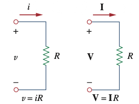
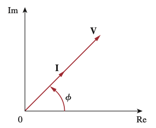

```{r setup, include=FALSE}
# Habilita pgfplots nos chunks {tikz} desta aula (gráficos de senoides).
knitr::opts_chunk$set(engine.opts = list(
  extra.preamble = c("\\usepackage{pgfplots}", "\\pgfplotsset{compat=1.18}")
))
```


---

## Resistor

Resistor $R$, corrente $i(t)$, tensão $v(t)$, Lei de Ohm:

$$i(t) = I_m\cos(\omega t + \phi_i) \rightarrow v(t) = R i(t) = R I_m\cos(\omega t + \phi_i)$$

Forma fasorial: $\;\mathbf{V} = R \mathbf{I} \qquad \rightarrow \qquad \mathbf{V} = V_m\angle\phi_v \text{ e } \mathbf{I} = I_m\angle\phi_i$

::: {.columns}
::: {.column width="50%"}
{fig-align="center" width="520px"}
:::
::: {.column width="50%"}
{fig-align="center" width="520px"}
:::
:::

## Resistor
