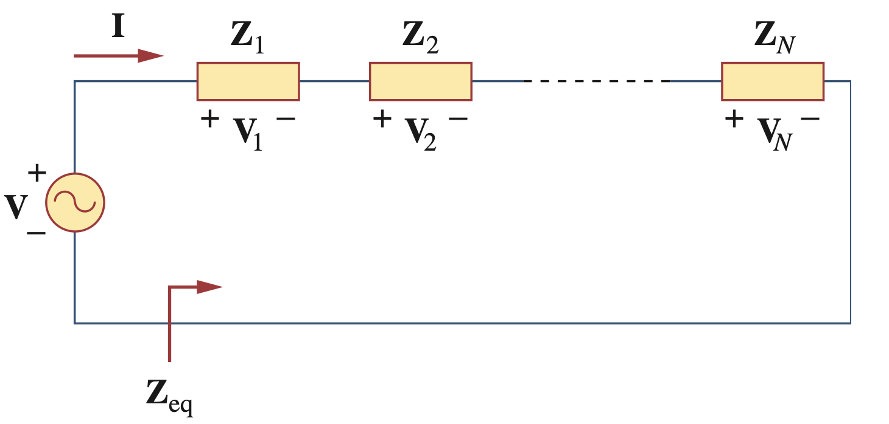
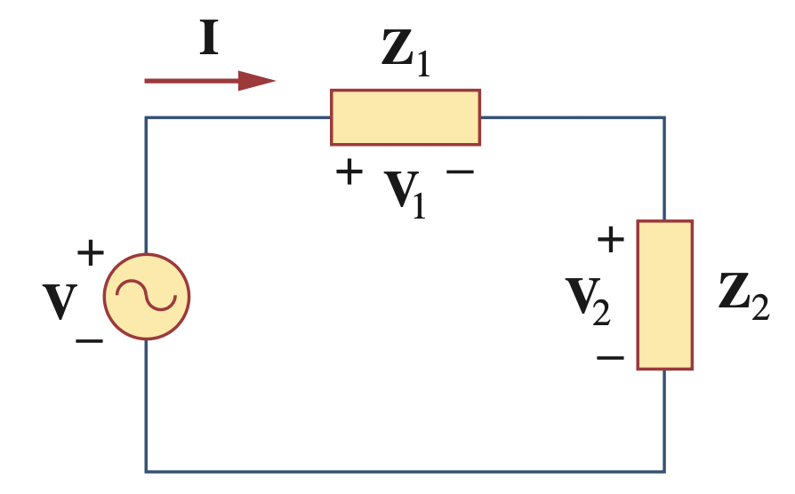
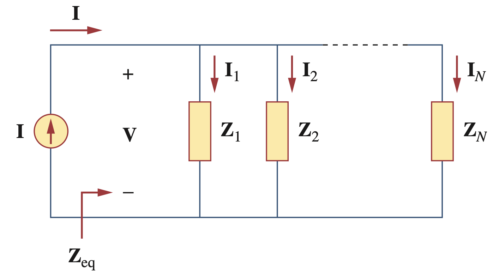
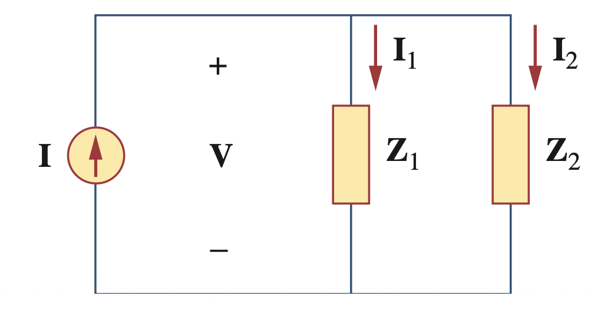
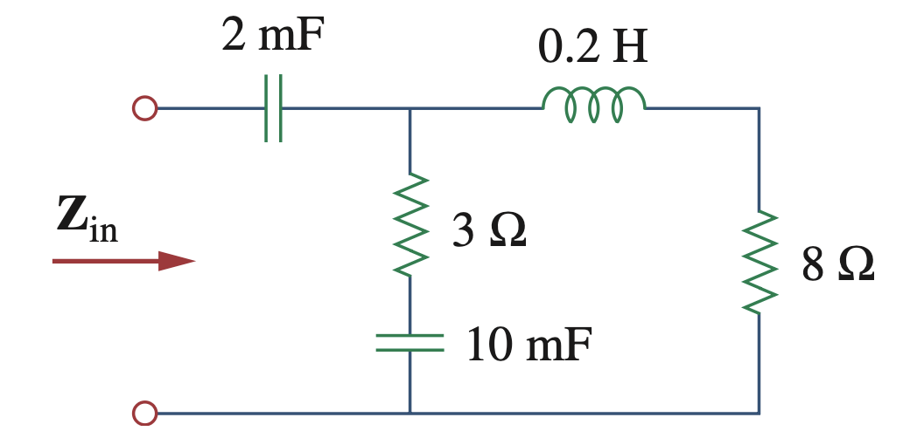
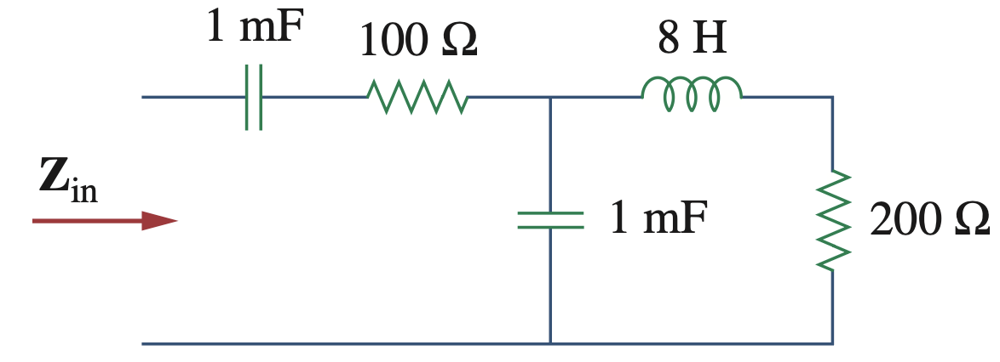
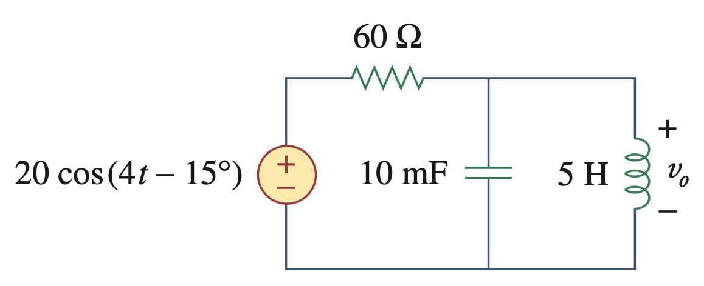
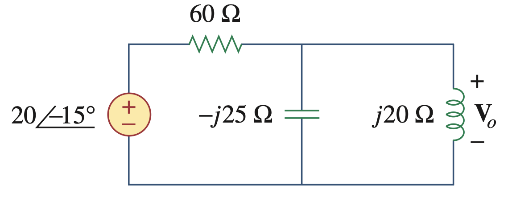
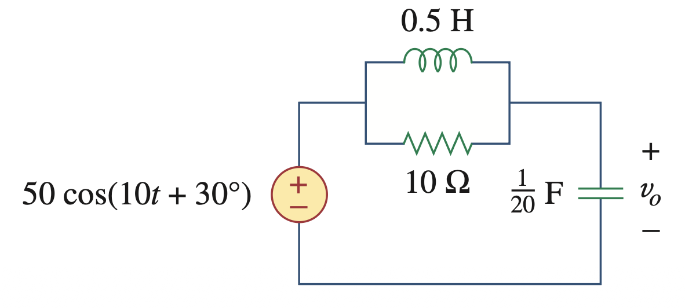

```{r setup, include=FALSE}
# Habilita circuitikz (diagramas de circuito) nos chunks {tikz} desta aula.
knitr::opts_chunk$set(engine.opts = list(
  extra.preamble = c("\\usepackage{circuitikz}"),
  # standalone's crop padrão só reconhece \begin{tikzpicture}; circuitikz usa
  # \begin{circuitikz}, então precisa ser listado explicitamente em "multi".
  classoption = "tikz,multi=circuitikz"
))
```

## Lei de Kirchhoff das Tensões no Domínio Fasorial

Para a LKT, sejam $v_1, v_2, \ldots, v_n$ as tensões em um laço fechado. Então:

$$v_1 + v_2 + \cdots + v_n = 0$$

Em regime senoidal permanente, cada tensão pode ser escrita na forma de cosseno:

$$V_{m1}\cos(\omega t+\theta_1) + V_{m2}\cos(\omega t+\theta_2) + \cdots + V_{mn}\cos(\omega t+\theta_n) = 0$$

Usando $\cos(\cdot) = \text{Re}(e^{j(\cdot)})$ e fazendo $\mathbf{V}_k = V_{mk}e^{j\theta_k}$:

$$\text{Re}\!\left[(\mathbf{V}_1+\mathbf{V}_2+\cdots+\mathbf{V}_n)\,e^{j\omega t}\right] = 0$$

Como $e^{j\omega t}\neq 0$ para todo $t$:

$$\boxed{\mathbf{V}_1 + \mathbf{V}_2 + \cdots + \mathbf{V}_n = 0}$$

---

## Lei de Kirchhoff das Correntes no Domínio Fasorial

Para a LKC, sejam $i_1, i_2, \ldots, i_n$ as correntes que chegam a um nó. Então:

$$i_1 + i_2 + \cdots + i_n = 0$$

Em regime senoidal permanente, cada corrente pode ser escrita na forma de cosseno:

$$I_{m1}\cos(\omega t+\theta_1) + I_{m2}\cos(\omega t+\theta_2) + \cdots + I_{mn}\cos(\omega t+\theta_n) = 0$$

Usando $\cos(\cdot) = \text{Re}(e^{j(\cdot)})$ e fazendo $\mathbf{I}_k = I_{mk}e^{j\theta_k}$:

$$\text{Re}\!\left[(\mathbf{I}_1+\mathbf{I}_2+\cdots+\mathbf{I}_n)\,e^{j\omega t}\right] = 0$$

Como $e^{j\omega t}\neq 0$ para todo $t$:

$$\boxed{\mathbf{I}_1 + \mathbf{I}_2 + \cdots + \mathbf{I}_n = 0}$$

---

## Impedância Equivalente — Associação em Série

{fig-align="center" width="850px"}

Aplicando a LKT ao laço: $\mathbf{V} = \mathbf{V}_1+\mathbf{V}_2+\cdots+\mathbf{V}_N = \mathbf{I}\mathbf{Z}_1+\mathbf{I}\mathbf{Z}_2+\cdots+\mathbf{I}\mathbf{Z}_N = \mathbf{I}(\mathbf{Z}_1+\mathbf{Z}_2+\cdots+\mathbf{Z}_N)$

A impedância equivalente vista pela fonte é:

$$\boxed{\mathbf{Z}_{eq} = \frac{\mathbf{V}}{\mathbf{I}} = \mathbf{Z}_1+\mathbf{Z}_2+\cdots+\mathbf{Z}_N = \sum_{n=1}^{N}\mathbf{Z}_n}$$

---

## Divisor de Tensão

Com base no resultado anterior, para dois elementos em série ($N=2$): $\mathbf{I} = \dfrac{\mathbf{V}}{\mathbf{Z}_1+\mathbf{Z}_2}$

{fig-align="center" width="550px"}

Como $\mathbf{V}_n = \mathbf{I}\mathbf{Z}_n$, a tensão sobre cada impedância é:

$$\boxed{\mathbf{V}_1 = \frac{\mathbf{Z}_1}{\mathbf{Z}_1+\mathbf{Z}_2}\,\mathbf{V}, \qquad \mathbf{V}_2 = \frac{\mathbf{Z}_2}{\mathbf{Z}_1+\mathbf{Z}_2}\,\mathbf{V}}$$

---

## Impedância Equivalente — Associação em Paralelo

{fig-align="center" width="850px"}

Aplicando a LKC ao nó superior: $\mathbf{I} = \mathbf{I}_1+\mathbf{I}_2+\cdots+\mathbf{I}_N = \dfrac{\mathbf{V}}{\mathbf{Z}_1}+\dfrac{\mathbf{V}}{\mathbf{Z}_2}+\cdots+\dfrac{\mathbf{V}}{\mathbf{Z}_N} = \mathbf{V}\left(\dfrac{1}{\mathbf{Z}_1}+\dfrac{1}{\mathbf{Z}_2}+\cdots+\dfrac{1}{\mathbf{Z}_N}\right)$

A impedância equivalente vista pela fonte é:

$$\boxed{\frac{1}{\mathbf{Z}_{eq}} = \frac{\mathbf{I}}{\mathbf{V}} = \frac{1}{\mathbf{Z}_1}+\frac{1}{\mathbf{Z}_2}+\cdots+\frac{1}{\mathbf{Z}_N} = \sum_{n=1}^{N}\frac{1}{\mathbf{Z}_n}}$$

---

## Divisor de Corrente

Com base no resultado anterior, para dois elementos em paralelo ($N=2$): $\mathbf{Z}_{eq} = \dfrac{\mathbf{Z}_1\mathbf{Z}_2}{\mathbf{Z}_1+\mathbf{Z}_2}$

{fig-align="center" width="550px"}

Como $\mathbf{V} = \mathbf{I}\mathbf{Z}_{eq} = \mathbf{I}_1\mathbf{Z}_1 = \mathbf{I}_2\mathbf{Z}_2$, a corrente em cada impedância é:

$$\boxed{\mathbf{I}_1 = \frac{\mathbf{Z}_2}{\mathbf{Z}_1+\mathbf{Z}_2}\,\mathbf{I}, \qquad \mathbf{I}_2 = \frac{\mathbf{Z}_1}{\mathbf{Z}_1+\mathbf{Z}_2}\,\mathbf{I}}$$

---

## Exemplo: Impedância de Entrada

**Problema:** Determine a impedância de entrada $\mathbf{Z}_{in}$ do circuito abaixo, considerando $\omega = 50$ rad/s.

{fig-align="center" width="700px"}

---

## Exemplo: Impedância de Entrada — Solução

Impedâncias dos elementos: $\mathbf{Z}_{C1} = \dfrac{1}{j\omega(2\text{ mF})} = -j10\ \Omega$, $\quad \mathbf{Z}_{C2} = \dfrac{1}{j\omega(10\text{ mF})} = -j2\ \Omega$, $\quad \mathbf{Z}_L = j\omega(0{,}2\text{ H}) = j10\ \Omega$

O ramo com $3\,\Omega$ e o capacitor de $10$ mF, em série, dá $3-j2\ \Omega$; o ramo com o indutor e o resistor de $8\,\Omega$, em série, dá $8+j10\ \Omega$. Esses dois ramos estão em paralelo:

$$\mathbf{Z}_p = \frac{(3-j2)(8+j10)}{(3-j2)+(8+j10)} = \frac{44+j14}{11+j8} = 3{,}22 - j1{,}07\ \Omega$$

Somando em série com o capacitor de $2$ mF:

$$\boxed{\mathbf{Z}_{in} = -j10 + \mathbf{Z}_p = 3{,}22 - j11{,}07\ \Omega}$$

---

## Exemplo: Impedância de Entrada (2)

**Problema:** Determine a impedância de entrada $\mathbf{Z}_{in}$ do circuito abaixo, considerando $\omega = 10$ rad/s.

{fig-align="center" width="850px"}

---

## Exemplo: Impedância de Entrada (2) — Solução

Impedâncias dos elementos: $\mathbf{Z}_{C1} = \mathbf{Z}_{C2} = \dfrac{1}{j\omega(1\text{ mF})} = -j100\ \Omega$, $\quad \mathbf{Z}_L = j\omega(8\text{ H}) = j80\ \Omega$

O ramo com o indutor e o resistor de $200\,\Omega$, em série, dá $200+j80\ \Omega$, em paralelo com o capacitor $\mathbf{Z}_{C2}$:

$$\mathbf{Z}_p = \frac{\mathbf{Z}_{C2}(200+j80)}{\mathbf{Z}_{C2}+200+j80} = \frac{-j100(200+j80)}{200-j20} = \frac{8000-j20000}{200-j20} = 49{,}5 - j95{,}05\ \Omega$$

Somando em série com o resistor de $100\,\Omega$ e o capacitor de $1$ mF:

$$\boxed{\mathbf{Z}_{in} = -j100 + 100 + \mathbf{Z}_p = 149{,}5 - j195{,}05\ \Omega}$$

---

## Exemplo: Tensão de Saída $v_o(t)$

**Problema:** Determine $v_o(t)$ no circuito abaixo.

{fig-align="center" width="750px"}

---

## Exemplo: Tensão de Saída — Domínio Fasorial

Fonte com $\omega = 4$ rad/s: $\mathbf{V}_s = 20\angle{-15°}$ V

Impedâncias: $\mathbf{Z}_C = \dfrac{1}{j\omega(10\text{ mF})} = -j25\ \Omega, \qquad \mathbf{Z}_L = j\omega(5\text{ H}) = j20\ \Omega$

O circuito equivalente no domínio da frequência:

{fig-align="center" width="750px"}

---

## Exemplo: Tensão de Saída — Solução

O capacitor e o indutor estão em paralelo:

$$\mathbf{Z}_p = \frac{\mathbf{Z}_C\mathbf{Z}_L}{\mathbf{Z}_C+\mathbf{Z}_L} = \frac{(-j25)(j20)}{-j25+j20} = \frac{500}{-j5} = j100\ \Omega$$

Por divisor de tensão, $\mathbf{V}_o$ é a tensão sobre $\mathbf{Z}_p$:

$$\mathbf{V}_o = \frac{\mathbf{Z}_p}{\mathbf{Z}_p+60}\,\mathbf{V}_s = \frac{j100}{60+j100}\,(20\angle{-15°}) = 17{,}15\angle 15{,}96°\ \text{V}$$

$$\boxed{v_o(t) = 17{,}15\cos(4t+15{,}96°)\ \text{V}}$$

---

## Exemplo: Tensão de Saída $v_o(t)$ (2)

**Problema:** Determine $v_o(t)$ no circuito abaixo.

{fig-align="center" width="800px"}

---

## Exemplo: Tensão de Saída (2) — Impedâncias

Fonte com $\omega=10$ rad/s: $\mathbf{V}_s = 50\angle 30°$ V

Impedâncias: $\mathbf{Z}_L = j\omega(0{,}5\text{ H}) = j5\ \Omega, \qquad \mathbf{Z}_C = \dfrac{1}{j\omega(1/20\text{ F})} = -j2\ \Omega$

O indutor e o resistor de $10\,\Omega$ estão em paralelo:

$$\mathbf{Z}_{LR} = \frac{\mathbf{Z}_L(10)}{\mathbf{Z}_L+10} = \frac{j5(10)}{10+j5} = 2+j4\ \Omega$$

Essa combinação está em série com o capacitor:

$$\boxed{\mathbf{Z} = \mathbf{Z}_{LR}+\mathbf{Z}_C = (2+j4)+(-j2) = 2+j2\ \Omega}$$

---

## Exemplo: Tensão de Saída (2) — Solução

Corrente do laço: $\mathbf{I} = \dfrac{\mathbf{V}_s}{\mathbf{Z}} = \dfrac{50\angle 30°}{2+j2} = 17{,}68\angle{-15°}\ \text{A}$

Tensão no capacitor: $\mathbf{V}_o = \mathbf{I}\,\mathbf{Z}_C = (17{,}68\angle{-15°})(2\angle{-90°}) = 35{,}36\angle{-105°}\ \text{V}$

$$\boxed{v_o(t) = 35{,}36\cos(10t-105°)\ \text{V}}$$
