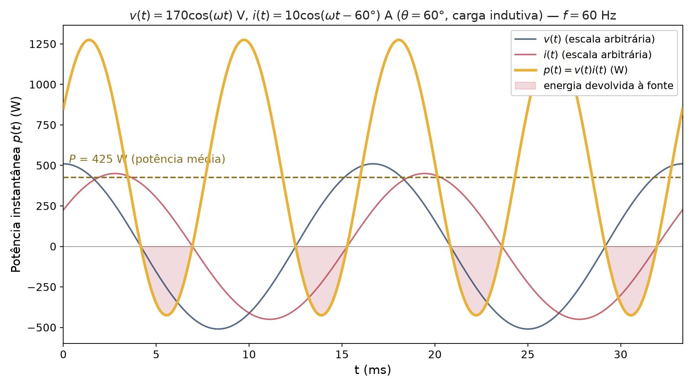

```{r setup, include=FALSE}
# Habilita circuitikz (diagrama do capacitor de correção) nos chunks
# {tikz} desta aula.
knitr::opts_chunk$set(engine.opts = list(
  extra.preamble = c("\\usepackage{circuitikz}"),
  classoption = "tikz,multi=circuitikz"
))
```

## Potência em CA: Por que Importa

::: {.callout-note}
Diferente da CC, em CA a potência **instantânea** varia no tempo — a análise exige distinguir potência instantânea, média, reativa, aparente e complexa.
:::

- Concessionárias faturam energia com base na potência **ativa** (kWh) — mas dimensionam a rede pela potência **aparente** (kVA).
- Cargas indutivas (motores, transformadores) consomem potência **reativa**, que **não realiza trabalho útil** mas ocupa capacidade do sistema.
- O **fator de potência** mede a eficiência com que a energia é convertida em trabalho útil.

---

## Potência Instantânea

Para $v(t) = V_m\cos(\omega t+\theta_v)$ e $i(t) = I_m\cos(\omega t+\theta_i)$, a potência instantânea é:

$$p(t) = v(t)\,i(t) = V_mI_m\cos(\omega t+\theta_v)\cos(\omega t+\theta_i)$$

Usando a identidade produto-para-soma e definindo o **ângulo de potência** $\theta=\theta_v-\theta_i$:

$$\boxed{p(t) = \underbrace{V_{rms}I_{rms}\cos\theta\,[1+\cos(2\omega t+2\theta_i)]}_{\text{parcela “resistiva”, sempre}\geq 0} \;-\; \underbrace{V_{rms}I_{rms}\sin\theta\,\sin(2\omega t+2\theta_i)}_{\text{parcela “reativa”, oscila em torno de }0}}$$

com $V_{rms}=V_m/\sqrt{2}$, $I_{rms}=I_m/\sqrt 2$. Note que $p(t)$ oscila no **dobro** da frequência de $v(t)$ e $i(t)$.

---

## Potência Instantânea — Visualização

{fig-align="center" width="82%"}

---

## Potência Média (Ativa)

A **potência média** é o valor médio de $p(t)$ ao longo de um período — apenas o primeiro termo da decomposição sobrevive à média (o segundo tem valor médio nulo):

$$\boxed{P = V_{rms}I_{rms}\cos\theta = \frac{1}{2}V_mI_m\cos(\theta_v-\theta_i)} \qquad [\text{W}]$$

::: {.callout-tip}
$P$ é a única componente que realiza **trabalho útil** (aquecimento, torque, luz) — é ela que a concessionária fatura em kWh.
:::

**Casos particulares:** carga puramente resistiva ($\theta=0$): $P=V_{rms}I_{rms}$. Carga puramente reativa ($\theta=\pm 90°$): $P=0$ — o elemento **não dissipa** energia, apenas a troca com a fonte.

---

## Potência Reativa

A amplitude da parcela oscilante "reativa" de $p(t)$ define a **potência reativa**:

$$\boxed{Q = V_{rms}I_{rms}\sin\theta = \frac{1}{2}V_mI_m\sin(\theta_v-\theta_i)} \qquad [\text{var}]$$

::: {.callout-important}
$Q$ **não representa consumo de energia líquido** — é a taxa de troca de energia entre a fonte e os campos elétrico/magnético de capacitores e indutores.
:::

| Elemento | $\theta$ | $Q$ | Convenção |
|---|:--:|:--:|---|
| Indutor | $+90°$ | $Q>0$ | absorve reativo (convenção "indutivo") |
| Capacitor | $-90°$ | $Q<0$ | fornece reativo (convenção "capacitivo") |
| Resistor | $0°$ | $Q=0$ | — |

---

## Potência Aparente e Potência Complexa

A **potência aparente** é o produto dos valores eficazes, sem considerar a defasagem:

$$S = V_{rms}I_{rms} \qquad [\text{VA}]$$

A **potência complexa** combina $P$ e $Q$ em um único número complexo, calculado diretamente dos fasores:

$$\boxed{\mathbf{S} = \frac{1}{2}\mathbf{V}\mathbf{I}^{*} = \mathbf{V}_{rms}\mathbf{I}_{rms}^{*} = P+jQ}$$

onde $\mathbf{I}^{*}$ é o **conjugado** do fasor de corrente. Note que $|\mathbf{S}|=S$ (a apparente é o módulo da complexa).

---

## Triângulo de Potências

As três grandezas — $P$, $Q$ e $S$ — formam um **triângulo retângulo**, com o ângulo de potência $\theta$ entre $P$ e $S$:

```{tikz}
%| echo: false
%| fig-align: center
%| fig-width: 7
\input{imgs/tikz/TrianguloPotencias.tikz}
```

$$S = \sqrt{P^2+Q^2}, \qquad \theta = \arctan\!\left(\frac{Q}{P}\right), \qquad P = S\cos\theta, \qquad Q = S\sin\theta$$

---

## Fator de Potência

::: {.callout-definition}
O **fator de potência** (fp) é a razão entre a potência ativa e a aparente:

$$\text{fp} = \frac{P}{S} = \cos\theta$$
:::

Como $\cos\theta$ é uma função par, o fp por si só não diz se a corrente adianta ou atrasa a tensão — por isso é sempre qualificado:

| Natureza | Condição | Corrente em relação à tensão |
|---|:--:|---|
| **Atrasado** (indutivo) | $\theta>0$ | Corrente **atrasa** — carga indutiva (motores, transformadores) |
| **Adiantado** (capacitivo) | $\theta<0$ | Corrente **adianta** — carga capacitiva (bancos de capacitores) |
| **Unitário** | $\theta=0$ | Corrente em fase — carga puramente resistiva |

---

## Exemplo Numérico Completo

**Dados:** $v(t) = 170\cos(\omega t)$ V, $i(t) = 10\cos(\omega t-60°)$ A (mesmo exemplo do gráfico de $p(t)$).

$$V_{rms} = \frac{170}{\sqrt2}=120{,}2\ \text{V}, \qquad I_{rms}=\frac{10}{\sqrt2}=7{,}07\ \text{A}, \qquad \theta = 0-(-60°)=60°$$

$$P = V_{rms}I_{rms}\cos 60° = 425\ \text{W} \qquad\qquad Q = V_{rms}I_{rms}\sin 60° = 736{,}1\ \text{var}$$

$$S = V_{rms}I_{rms} = 850\ \text{VA} \qquad\qquad \text{fp} = \frac{P}{S} = 0{,}5 \text{ atrasado (indutivo)}$$

---

## Correção do Fator de Potência — Motivação

::: {.callout-warning}
## Por que corrigir?
Um fp baixo exige **maior corrente** para entregar a mesma potência ativa $P$ — aumentando perdas ($RI^2$) na fiação e exigindo transformadores/condutores sobredimensionados. Concessionárias frequentemente **penalizam** consumidores industriais com fp abaixo de um limite (no Brasil, tipicamente 0,92).
:::

**Solução:** instalar um **banco de capacitores em paralelo** com a carga indutiva, para fornecer parte da potência reativa localmente — sem alterar $P$ nem a tensão da carga.

```{tikz}
%| echo: false
%| fig-align: center
%| fig-width: 9
\input{imgs/tikz/CircuitoCorrecaoFP.tikz}
```

---

## Correção do Fator de Potência — Método

```{tikz}
%| echo: false
%| fig-align: center
%| fig-width: 7.5
\input{imgs/tikz/CorrecaoFatorPotencia.tikz}
```

O capacitor **não altera $P$** (não dissipa potência ativa); ele reduz apenas $Q$, de $Q_1$ (fp$_1$) para $Q_2$ (fp$_2$, desejado), fornecendo:

$$Q_c = Q_1-Q_2 = P(\tan\theta_1-\tan\theta_2)$$

Como a reatância capacitiva fornece $Q_c = \omega C V_{rms}^2$ (potência reativa **negativa**, na convenção da carga):

$$\boxed{C = \frac{Q_c}{\omega V_{rms}^2}}$$

---

## Correção do Fator de Potência — Exemplo Numérico

**Dados:** carga com $P=1200$ W, fp$_1=0{,}75$ atrasado, alimentada em $V_{rms}=220$ V, $f=60$ Hz. Deseja-se corrigir para fp$_2=0{,}95$ atrasado.

$$\theta_1=\arccos(0{,}75)=41{,}4° \implies Q_1 = P\tan\theta_1 = 1058{,}3\ \text{var}, \quad S_1=\frac{P}{\text{fp}_1}=1600\ \text{VA}$$

$$\theta_2=\arccos(0{,}95)=18{,}2° \implies Q_2 = P\tan\theta_2 = 394{,}4\ \text{var}, \quad S_2=\frac{P}{\text{fp}_2}=1263{,}2\ \text{VA}$$

$$Q_c = Q_1-Q_2 = 663{,}9\ \text{var}$$

$$C = \frac{Q_c}{\omega V_{rms}^2} = \frac{663{,}9}{(2\pi\cdot 60)(220)^2} = \boxed{36{,}4\ \mu\text{F}}$$

::: {.callout-note}
Note a redução de $S$ (de $1600$ para $1263$ VA): a mesma potência ativa passa a exigir **menos** capacidade da rede.
:::

---

## Máxima Transferência de Potência Média — Revisão

Já demonstrado na Unidade 4 em termos de fasores de pico; em termos de valores eficazes, para uma fonte de Thévenin $\mathbf{V}_{th,rms}$, $\mathbf{Z}_{th}=R_{th}+jX_{th}$:

$$\mathbf{Z}_L = \mathbf{Z}_{th}^{*} \quad\Longrightarrow\quad P_{max} = \frac{|\mathbf{V}_{th,rms}|^2}{4R_{th}}$$

::: {.callout-tip}
Compare com a fórmula em amplitude de pico da Unidade 4, $P_{max}=|\mathbf{V}_{th}|^2/(8R_{th})$: como $V_{th,rms}=V_{th}/\sqrt2$, as duas expressões coincidem — $|\mathbf{V}_{th,rms}|^2/(4R_{th}) = |\mathbf{V}_{th}|^2/(8R_{th})$.
:::

---

## Resumo das Potências em CA

| Grandeza | Símbolo | Unidade | Fórmula |
|---|:--:|:--:|---|
| Instantânea | $p(t)$ | W | $v(t)i(t)$ |
| Ativa (média) | $P$ | W | $V_{rms}I_{rms}\cos\theta$ |
| Reativa | $Q$ | var | $V_{rms}I_{rms}\sin\theta$ |
| Aparente | $S$ | VA | $V_{rms}I_{rms} = \sqrt{P^2+Q^2}$ |
| Complexa | $\mathbf{S}$ | VA | $\mathbf{V}_{rms}\mathbf{I}_{rms}^{*} = P+jQ$ |
| Fator de potência | fp | — | $P/S=\cos\theta$ |

---

## Exercícios

1. Uma carga tem $v(t)=311\cos(377t)$ V e $i(t)=8\cos(377t+30°)$ A. Calcule $P$, $Q$, $S$, $\mathbf{S}$ e o fp, classificando sua natureza.
2. Mostre que, para uma carga puramente resistiva, $p(t)\geq 0$ para todo $t$ (nunca há retorno de energia à fonte).
3. Uma indústria consome $P=50$ kW com fp$=0{,}68$ atrasado, em $V_{rms}=380$ V e $f=60$ Hz. Dimensione o banco de capacitores (em $\mu$F, ligados em paralelo) para elevar o fp a $0{,}95$.
4. Explique, usando o triângulo de potências, por que a correção do fator de potência com capacitores **não** altera a potência ativa consumida pela carga.
5. Duas cargas, $\mathbf{S}_1 = 3+j4$ kVA e $\mathbf{S}_2 = 5-j2$ kVA, estão em paralelo, alimentadas pela mesma tensão. Calcule a potência complexa total e o fp resultante.

---

## Referências

::: {#refs}
:::
