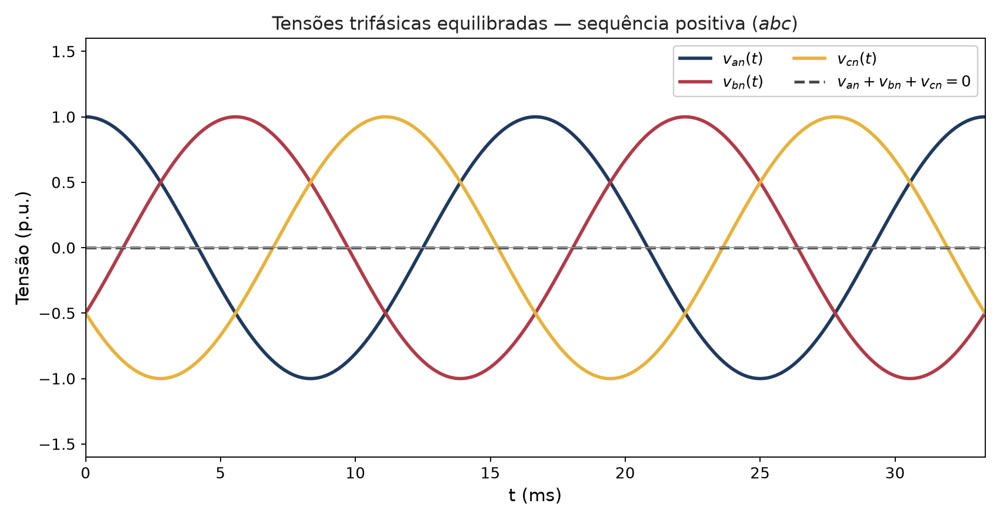

```{r setup, include=FALSE}
# Habilita circuitikz (diagramas de conexão e de circuito) nos chunks
# {tikz} desta aula.
knitr::opts_chunk$set(engine.opts = list(
  extra.preamble = c("\\usepackage{circuitikz}"),
  classoption = "tikz,multi=circuitikz"
))
```

## Por que Sistemas Trifásicos?

- Praticamente **toda** a geração, transmissão e distribuição de energia em grande escala é trifásica.
- Para a mesma potência entregue, um sistema trifásico usa **menos condutor** que três sistemas monofásicos independentes.
- A potência instantânea total de um sistema trifásico **equilibrado** é **constante no tempo** — motores trifásicos giram sem o "trepidar" de torque de motores monofásicos.

::: {.callout-note}
## Equilibrado
Um sistema é **equilibrado** quando as três tensões (ou correntes) têm a **mesma amplitude**, a **mesma frequência** e são defasadas de exatamente **120°** entre si. Esta aula trata apenas do caso equilibrado.
:::

---

## Geração de Tensões Trifásicas

Um gerador trifásico tem três enrolamentos idênticos, espaçados fisicamente de $120°$, girando em um campo magnético. Isso induz três tensões senoidais de mesma amplitude e frequência, defasadas de $120°$ **elétricos** entre si:

$$v_{an}(t) = V_m\cos(\omega t), \quad v_{bn}(t) = V_m\cos(\omega t-120°), \quad v_{cn}(t) = V_m\cos(\omega t+120°)$$

{fig-align="center" width="78%"}

---

## Sequência de Fases

A **sequência de fases** descreve a ordem em que as tensões atingem seu valor de pico:

| Sequência | Definição | Fasores |
|---|---|---|
| **Positiva** ($abc$) | $b$ atrasa $a$ em $120°$, $c$ atrasa $a$ em $240°$ | $\mathbf{V}_{an}=V_p\angle 0°$, $\mathbf{V}_{bn}=V_p\angle{-120°}$, $\mathbf{V}_{cn}=V_p\angle 120°$ |
| **Negativa** ($acb$) | $c$ atrasa $a$ em $120°$, $b$ atrasa $a$ em $240°$ | $\mathbf{V}_{an}=V_p\angle 0°$, $\mathbf{V}_{cn}=V_p\angle{-120°}$, $\mathbf{V}_{bn}=V_p\angle 120°$ |

::: {.callout-warning}
A sequência de fases determina o **sentido de rotação** de motores trifásicos — trocar duas fases inverte a sequência e o sentido de giro.
:::

Esta aula adota, salvo indicação contrária, a **sequência positiva** ($abc$).

---

## Diagrama Fasorial e Relação Fase-Linha

```{tikz}
%| echo: false
%| fig-align: center
%| fig-width: 9
\input{imgs/tikz/FasoresTrifasicos.tikz}
```

A **tensão de fase** ($\mathbf{V}_{an}$, entre linha e neutro) e a **tensão de linha** ($\mathbf{V}_{ab}$, entre duas linhas) se relacionam por:

$$\boxed{\mathbf{V}_{ab} = \mathbf{V}_{an}-\mathbf{V}_{bn} = \sqrt{3}\,\mathbf{V}_{an}\angle 30°}$$

---

## Conexões da Fonte: Y e $\Delta$

```{tikz}
%| echo: false
%| fig-align: center
%| fig-width: 14
\input{imgs/tikz/ConexoesTrifasicas.tikz}
```

Na conexão **Y**, existe um ponto neutro (comum às três fontes); na conexão **$\Delta$**, não há neutro — as três fontes formam um laço fechado.

---

## Conexões da Carga: Y e $\Delta$

```{tikz}
%| echo: false
%| fig-align: center
%| fig-width: 14
\input{imgs/tikz/CargaYDelta.tikz}
```

Cargas trifásicas equilibradas têm a **mesma impedância** nas três fases ($\mathbf{Z}_Y$ ou $\mathbf{Z}_\Delta$). A relação entre as duas formas (Unidade 2, caso balanceado):

$$\mathbf{Z}_\Delta = 3\,\mathbf{Z}_Y$$

---

## Relações Fase-Linha: Resumo

| Conexão | Tensão de linha $V_L$ | Corrente de linha $I_L$ |
|---|---|---|
| **Y** (fonte ou carga) | $V_L=\sqrt{3}\,V_p$, adiantada $30°$ | $I_L = I_p$ (mesma corrente da fase) |
| **$\Delta$** (fonte ou carga) | $V_L = V_p$ (mesma tensão da fase) | $I_L=\sqrt{3}\,I_p$, atrasada $30°$ |

::: {.callout-tip}
Nas quatro combinações possíveis (Y-Y, Y-$\Delta$, $\Delta$-$\Delta$, $\Delta$-Y), converta sempre fontes e cargas em $\Delta$ para o equivalente em **Y** — isso permite resolver **qualquer** sistema equilibrado pelo método de um único circuito monofásico equivalente.
:::

---

## O Método do Circuito Monofásico Equivalente

Em um sistema **equilibrado**, todas as três fases se comportam de forma idêntica, apenas defasadas $120°$. Isso permite:

1. Converter toda fonte e carga em $\Delta$ para seu equivalente em **Y**.
2. Resolver **apenas a fase $a$** (com o neutro como referência), como um circuito monofásico comum.
3. Obter as fases $b$ e $c$ apenas **defasando** o resultado de $-120°$ e $+120°$ (sequência $abc$).

::: {.callout-important}
Em um sistema Y-Y equilibrado, a corrente no neutro é **sempre nula** ($\mathbf{I}_n=0$) — por isso o neutro pode ser incluído (ou omitido) sem alterar a solução.
:::

---

## Sistema Y-Y Equilibrado — Circuito Monofásico

```{tikz}
%| echo: false
%| fig-align: center
%| fig-width: 11
\input{imgs/tikz/SistemaYY.tikz}
```

**Dados:** $\mathbf{V}_{an}=220\angle 0°$ V (rms), $\mathbf{Z}_{line}=1+j2\ \Omega$, $\mathbf{Z}_Y=20+j15\ \Omega$, sequência $abc$.

---

## Sistema Y-Y — Solução (Fase $a$)

$$\mathbf{I}_a = \frac{\mathbf{V}_{an}}{\mathbf{Z}_{line}+\mathbf{Z}_Y} = \frac{220\angle 0°}{21+j17} = \boxed{8{,}14\angle{-39{,}0°}\ \text{A}}$$

Pela sequência $abc$, as demais correntes de linha são **a mesma amplitude, defasada** $120°$:

$$\mathbf{I}_b = 8{,}14\angle{-159{,}0°}\ \text{A} \qquad\qquad \mathbf{I}_c = 8{,}14\angle 81{,}0°\ \text{A}$$

Tensão de fase na carga: $\quad \mathbf{V}_{AN} = \mathbf{I}_a\mathbf{Z}_Y = 203{,}6\angle{-2{,}1°}\ \text{V}$

---

## Sistema Y-Y — Potência

Com $\mathbf{Z}_Y=20+j15\ \Omega = 25\angle 36{,}9°\ \Omega$ (fp $=\cos 36{,}9°=0{,}8$ atrasado), a potência **total** entregue à carga (soma das três fases):

$$P = 3\,V_{p,carga}\,I_L\cos\theta = 3(203{,}6)(8{,}14)(0{,}8) = \boxed{3978\ \text{W}}$$

$$Q = 3\,V_{p,carga}\,I_L\sin\theta = 2984\ \text{var} \qquad\qquad S=3\,V_{p,carga}\,I_L = 4973\ \text{VA}$$

::: {.callout-note}
As perdas na linha são $P_{line}=3|\mathbf{I}_a|^2R_{line}=3(8{,}14)^2(1)\approx 199$ W — a fonte fornece $P+P_{line}\approx 4177$ W no total.
:::

---

## Potência em Sistemas Trifásicos: Fórmula em Grandezas de Linha

Como $V_L=\sqrt{3}V_p$ (conexão Y) e $I_L=I_p$, a potência total pode ser expressa diretamente em **grandezas de linha** — válida tanto para carga em Y quanto em $\Delta$:

$$\boxed{P = \sqrt{3}\,V_L I_L\cos\theta \qquad Q=\sqrt{3}\,V_L I_L\sin\theta \qquad S=\sqrt{3}\,V_L I_L}$$

onde $\theta$ é o ângulo da impedância de carga (defasagem entre tensão e corrente **de fase**, não de linha).

::: {.callout-warning}
O $\sqrt{3}$ aqui **não** é o mesmo fator da relação $V_L=\sqrt{3}V_p$: é uma coincidência algébrica de se poder escrever a potência total das três fases diretamente em termos de $V_L$ e $I_L$. Verifique substituindo $V_L=\sqrt3 V_p$ na expressão $P=3V_pI_p\cos\theta$.
:::

---

## Medição de Potência: Método dos Dois Wattímetros

Em um sistema trifásico a três fios (sem neutro acessível), a potência total pode ser medida com **apenas dois** wattímetros:

```{tikz}
%| echo: false
%| fig-align: center
%| fig-width: 9
\input{imgs/tikz/DoisWattimetros.tikz}
```

Bobinas de corrente nas linhas $a$ e $c$; bobinas de potencial referenciadas à linha $b$.

---

## Dois Wattímetros — Fórmulas

Com $\theta$ = ângulo da impedância de carga, $V_L$ e $I_L$ = tensão e corrente de linha (rms):

$$W_1 = V_LI_L\cos(\theta+30°) \qquad\qquad W_2 = V_LI_L\cos(\theta-30°)$$

Somando e subtraindo, obtém-se a potência ativa e reativa **totais** das três fases:

$$\boxed{P = W_1+W_2 = \sqrt{3}\,V_LI_L\cos\theta} \qquad\qquad \boxed{Q = \sqrt{3}\,(W_2-W_1) = \sqrt{3}\,V_LI_L\sin\theta}$$

::: {.callout-tip}
O fator de potência pode ser recuperado sem medir tensão/corrente separadamente: $\tan\theta = \sqrt{3}\,\dfrac{W_2-W_1}{W_1+W_2}$.
:::

---

## Dois Wattímetros — Exemplo Numérico

Usando os dados do sistema Y-Y anterior ($V_L=\sqrt3(203{,}6)=352{,}7$ V, $I_L=8{,}14$ A, $\theta=36{,}9°$):

$$W_1 = (352{,}7)(8{,}14)\cos(66{,}9°) = 1128\ \text{W}$$

$$W_2 = (352{,}7)(8{,}14)\cos(6{,}9°) = 2850\ \text{W}$$

**Verificação:** $W_1+W_2=3978$ W $=P$ (confere com o cálculo direto do slide anterior) e $\sqrt3(W_2-W_1)=2984$ var $=Q$.

---

## Resumo da Unidade

| Conceito | Resultado-chave |
|---|---|
| Sequência de fases | $abc$ (positiva) ou $acb$ (negativa) |
| Fase → linha (Y) | $V_L=\sqrt3 V_p\angle 30°$, $I_L=I_p$ |
| Fase → linha ($\Delta$) | $V_L=V_p$, $I_L=\sqrt3 I_p\angle{-30°}$ |
| Equivalência Y-$\Delta$ | $\mathbf{Z}_\Delta=3\mathbf{Z}_Y$ |
| Método de solução | Circuito monofásico equivalente (fase $a$) + defasagem $\mp 120°$ |
| Potência total | $P=\sqrt3\,V_LI_L\cos\theta$ |
| Medição | Dois wattímetros: $P=W_1+W_2$, $Q=\sqrt3(W_2-W_1)$ |

---

## Exercícios

1. Um sistema Y-Y equilibrado tem $\mathbf{V}_{an}=127\angle 0°$ V (rms), $\mathbf{Z}_{line}\approx 0$ e $\mathbf{Z}_Y=10+j10\ \Omega$. Calcule $\mathbf{I}_a$, a tensão de linha $\mathbf{V}_{ab}$ e a potência total.
2. Uma carga em $\Delta$ equilibrada com $\mathbf{Z}_\Delta=30\angle 20°\ \Omega$ é alimentada com $V_L=380$ V (rms). Calcule $I_p$, $I_L$ e a potência total $P$.
3. Converta a carga do exercício anterior para sua estrela equivalente e resolva novamente pelo circuito monofásico, confirmando o mesmo valor de $P$.
4. Em um sistema com dois wattímetros, $W_1=1200$ W e $W_2=2400$ W. Determine o fator de potência da carga e classifique sua natureza (indutiva/capacitiva), sabendo que a carga é indutiva.
5. Explique por que, em um sistema Y-Y equilibrado a **quatro** fios (com neutro), a corrente no neutro é nula, e o que aconteceria a essa corrente se a carga fosse **desequilibrada**.

---

## Referências

::: {#refs}
:::
